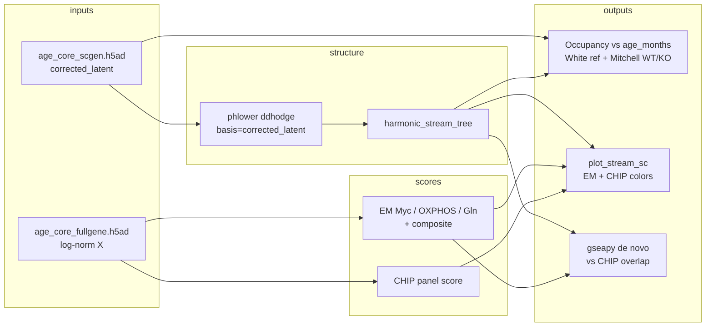

> **Superseded** by `docs/plans/2026-07-23-003-feat-shallow-tree-gnn-path-persistence-plan.md`
> (shallow tree-GNN path persistence; age_bin vertical; HSPC→Myeloid_prog start/end).
> Do not implement from this file.

## Goal Capsule

**Objective:** On the existing age-core scGen atlas, quantify HSC→GMP occupancy along chronological age (White reference; Mitchell WT vs IL1R1KO) and visualize branch streams colored by EM metabolic scores (Myc–OXPHOS–Gln) and CHIP as a parallel axis, using custom analysis code plus the existing PHLOWER STREAM plotting helpers.

**Authority:** Session-settled decisions below override stale README TMS wording. `explore.py` age-core GEO list is the cohort source of truth.

**Stop when:** Occupancy tables/plots and EM/CHIP stream figures write under `data/joint_hsc_aging/`; `plotting.py` imports without `cvae`; README no longer points occupancy at TMS; smoke validation passes without TMS.

---

## Product Contract

### Summary

Plan one analysis pipeline on the age-core mouse BM atlas already integrated with scGen. Drop Tabula Muris Senis for this work. Read occupancy shifts on the age-core chronological axis alone. Fit PHLOWER STREAM trees on the scGen embedding and plot EM + CHIP scores on branch streams via extended helpers. Do not use CellOracle for stromal IL-1.

### Problem Frame

IL-1 drives HSCs toward myeloid differentiation and amplifies GMPs; Mitchell already tests Il1r1 genetically. The open computational question is whether Il1r1 loss shifts HSC→GMP occupancy relative to chronological aging in the joint age-core atlas, and how EM metabolic programs (and CHIP-related genes) vary along the differentiation stream—not a generic glycolysis-vs-OXPHOS cartoon.

### Requirements

- R1. Use the age-core GEO set from `explore.py` (Mitchell GSE169162, White GSE310923, Yang GSE169608, Hérault GSE147729, Elias GSE246464; Su holdout stays excluded from primary joint by default).
- R2. Keep scGen `batch_removal` with `batch_key=technical_batch` only; never put age or genotype in the batch key.
- R3. Measure HSC→GMP occupancy vs chronological age on age-core alone (no TMS); White WT is the occupancy reference curve.
- R4. Contrast Mitchell `genotype` WT vs `IL1R1KO` occupancy against that reference (frame for old-only KO coverage).
- R5. Score EM axes Myc, OXPHOS, and Gln separately, plus a composite EM score; do not use Hallmark glycolysis as the primary metabolic story.
- R6. Score CHIP genes as a parallel `.obs` axis; run de novo enrichment on branch/stream DE and report overlap vs CHIP.
- R7. Fit a PHLOWER STREAM tree on the scGen embedding and plot continuous EM/CHIP scores on stream/subway maps using (and extending) `plotting.py`.
- R8. Prefer custom analysis modules over black-box wrappers; reuse PHLOWER plot helpers rather than inventing a second viz stack.
- R9. Update README so occupancy language matches age-core (not TMS).

### Scope Boundaries

**In scope**
- Unblocking `plotting.py` imports without rebuilding cVAE
- Gene-set scoring, occupancy metrics, PHLOWER tree fit, stream figures, gseapy enrichment, thin CLI/orchestration, age-core-only validation smoke, README sync

**Out of scope**
- CellOracle / GRN inference for stromal IL-1
- TMS integration or TMS chronological axis
- Treating graph learning / CellRank as first-class (deferred unless STREAM fails)
- Rebuilding Su into the primary scGen UMAP
- Replacing scGen with another integrator
- Full cVAE / age-week calibration revival

### Deferred to Follow-Up Work

- Young×Il1r1KO interaction (no young KO in Mitchell GSE169162)
- Multi-age adult densification (Su holdout or new cohorts)
- CellRank / velocity fate probabilities if STREAM tree quality is insufficient

---

## Planning Contract

### Key Technical Decisions

- KTD1. **Cohort source of truth is `explore.py` age-core, not README TMS.** (session-settled: user-directed — chosen over Mitchell+TMS-only integration)
- KTD2. **Occupancy uses age-core chronological age only.** (session-settled: user-directed — chosen over TMS age axis; adults remain sparse)
- KTD3. **One plan covers occupancy + EM/CHIP-on-streams.** (session-settled: user-directed — chosen over sequenced follow-ups)
- KTD4. **Custom analysis + existing PHLOWER STREAM helpers.** (session-settled: user-directed — chosen over graph-learning-first or helpers-only black box)
- KTD5. **scGen preserves age biology by keeping age/genotype out of `batch_key`.** Resolve embedding like `explore.run_umap`: prefer `obsm["corrected_latent"]`, else `X_scgen`, else `latent`. Gene scores use full-gene / log-normalized expression (`age_core_fullgene.h5ad` or `.raw`), not the 7k HVG latent.
- KTD6. **PHLOWER entry is `ddhodge(basis=<resolved scGen latent>)` then the documented STREAM sequence ending in `harmonic_stream_tree`.** Prefer the scGen latent key (not PCA of expression). If installed phlower 0.1.5 rejects a non-PCA `basis`, document that failure and only then fall back to PCA of corrected expression — do not silently switch.
- KTD7. **EM panels from mouse MSigDB:** Hallmark MYC targets, Hallmark OXPHOS, GOBP glutamine metabolic process (optionally compact Gln core: Gls/Gls2, Glud1, Glul); composite = z-mean of the three scores. Biology anchor: Pizzato et al. JEM 2023 (glutaminolysis / emergency myelopoiesis).
- KTD8. **Il1r1 analysis is old-KO vs WT relative to White young/old reference** — Mitchell `IL1R1KO` is old-only in age-core; do not claim a KO×age trajectory.
- KTD9. **Occupancy metrics are relative** (within-age-group stream-bin fractions, bootstrap CIs, optional 1-D Wasserstein on stream position CDFs). Avoid absolute KDEs that collapse when adults are sparse (Yang adult n≈546 in joint).
- KTD10. **Unblock plotting by defining `BM_BRANCHES` locally** (or a tiny `branches.py`); do not resurrect missing `cvae.py` for this plan. Soften `__init__.py` re-exports so scripts remain runnable under `package = false`.
- KTD11. **Align White `age_months` young to 4.0** (paper / current `preprocess_scrna.py`) wherever occupancy-on-months is reported; note cache drift if qc h5ad still says 3.0.

Product Contract preservation: N/A (ce-plan-bootstrap). README TMS sentence is superseded by KTD1–2 and R9.

### Assumptions

- Existing `data/joint_hsc_aging/age_core_scgen.h5ad` (+ fullgene sibling) are usable starting points; retrain scGen only if occupancy/stream QC fails mixing gates.
- CHIP parallel panel = curated mouse orthologs of common CHIP drivers (e.g. Dnmt3a, Tet2, Asxl1, Jak2 and related panel genes from project citations); exact membership is an implementation curation step with coverage logging.
- Default stream root = HSPC / early annotation; exact root label resolved when fitting against White/Mitchell annotations.

### High-Level Technical Design

### Sequencing

U1 → U2 → U3 and U4 in parallel after U2 scores exist on the object → U5 (plots) → U6 (enrichment) → U7 (orchestration + README) → U8 (smoke validation).

---

## Implementation Units

### U1. Unblock STREAM plotting imports

**Goal:** Make `plotting.py` importable without `cvae.py` under `package = false`.

**Requirements:** R7, R8; KTD4, KTD10

**Dependencies:** None

**Files:**
- modify: `plotting.py`
- modify: `__init__.py` (optional soft export; avoid hard-requiring missing cVAE)
- create: `branches.py` (optional — only if `BM_BRANCHES` should live outside plotting)
- test: `tests/test_plotting_imports.py`

**Approach:** Replace `from .cvae import BM_BRANCHES` with a local default branch-order tuple (or `branches.py`). Prefer absolute imports that work when running scripts from repo root. Do not implement cVAE.

**Patterns to follow:** Thin wrappers already in `plotting.py`; keep plot API stable (`plot_stream`, `plot_stream_sc`, `plot_gene_stream`).

**Test scenarios:**
- Happy path: importing plotting helpers succeeds without `cvae.py` on `sys.path`.
- Edge: `branch_preference()` returns a non-empty ordered list usable as PHLOWER `preference`.
- Error: missing optional phlower is not required for the import-only unit test if mocked; document runtime need for phlower in verification.

**Verification:** `tests/test_plotting_imports.py` passes; `python -c "import plotting"` (or package-equivalent) works from repo root with venv.

---

### U2. EM and CHIP gene-set scoring

**Goal:** Write Myc, OXPHOS, Gln, composite EM, and CHIP scores onto cells using full-gene expression.

**Requirements:** R5, R6; KTD7

**Dependencies:** None (consumes existing h5ads)

**Files:**
- create: `gene_sets_em_chip.py`
- create: `score_em_chip.py`
- test: `tests/test_score_em_chip.py`

**Approach:** Curate mouse gene lists (MSigDB mouse Hallmark MYC / OXPHOS; GOBP glutamine; CHIP ortholog panel). `score_genes` per axis into `.obs`; composite = z-mean of the three EM scores. Log gene coverage; refuse silent empty panels. Join scores onto the scGen object by shared `obs_names` from `age_core_fullgene.h5ad` (or score on fullgene and subset).

**Execution note:** Prefer a small fixture AnnData with known gene symbols over GPU-heavy full atlas in unit tests.

**Test scenarios:**
- Happy path: with synthetic counts and known gene hits, each score column is finite and named as specified.
- Edge: genes absent from `var_names` are dropped with coverage warning; score still runs if ≥N genes remain (threshold documented in module).
- Error: zero overlapping genes raises a clear error (no NaN-only silent column).
- Integration: scoring reads fullgene path and writes columns joinable to scGen obs index.

**Verification:** Unit tests green; on real fullgene, coverage report printed and score columns present for a subsampled smoke run.

---

### U3. Age-core occupancy vs chronological age

**Goal:** Quantify HSC→GMP (or Myeloid_prog fraction) occupancy vs `age_months` / `age_group` with White reference and Mitchell WT vs IL1R1KO overlay.

**Requirements:** R1–R4; KTD2, KTD8, KTD9, KTD11

**Dependencies:** U2 optional (occupancy can use lineage alone first; stream-bin occupancy needs U4)

**Files:**
- create: `occupancy_age_core.py`
- test: `tests/test_occupancy_age_core.py`

**Approach:**
1. Lineage occupancy: fraction `Myeloid_prog / (HSPC + Myeloid_prog)` (and optional finer White FACS labels if retained) stratified by `age_months`, `age_group`, `dataset`, `genotype`.
2. White WT = reference curve; Mitchell WT vs `IL1R1KO` compared at old (and WT young/old where available).
3. After U4: same fractions within STREAM bins / late-GMP bins; bootstrap CIs; optional Wasserstein between age_group CDFs on stream position.
4. Persist CSV/JSON under `data/joint_hsc_aging/` plus simple matplotlib figures.

**Test scenarios:**
- Happy path: synthetic obs with known lineage/age/genotype yields expected fractions.
- Edge: adult group with tiny n still returns fractions + CI width reflecting sparsity (no crash).
- Error: missing `age_months` or `lineage` raises clear error.
- Covers AE framing: IL1R1KO-only-old path does not invent young KO rows.

**Verification:** Tables written; White reference and Mitchell genotype split visible; no TMS paths imported.

---

### U4. Fit PHLOWER STREAM on scGen latent

**Goal:** Build Hodge trajectories + STREAM tree rooted in early HSPC on `corrected_latent`.

**Requirements:** R7; KTD5, KTD6

**Dependencies:** U1 (importable helpers)

**Files:**
- create: `stream_age_core.py`
- modify: `plotting.py` (optional thin wrap of `ddhodge` prelude if useful)
- test: `tests/test_stream_age_core.py` (lightweight / mocked where GPU-heavy)

**Approach:** Load `age_core_scgen.h5ad`; resolve embedding per KTD5; run PHLOWER with `ddhodge(basis=<resolved key>)` then STREAM → `harmonic_stream_tree` (`min_bin_number≈20`, `cut_threshold≈1.5`). Root = HSPC / early cells. Persist annotated h5ad. Optional: fit tree on WT-only then map KO if genotype distorts topology (execution-time; document). PCA-of-expression only if KTD6 escape fires.

**Execution note:** First successful smoke on a downsampled age-core subset before full atlas; GPU/NUMBA_CACHE_DIR patterns from `explore.py`.

**Test scenarios:**
- Happy path: mocked adata with required obsm key completes prelude function boundaries without TMS.
- Edge: missing `corrected_latent` falls back to `X_scgen` or errors explicitly.
- Integration: after real smoke, `uns`/`obs` contain STREAM tree fields required by `plot_stream_sc`.

**Verification:** Stream-annotated h5ad exists; subway plot of lineage/age_group renders without error.

---

### U5. EM/CHIP colors on branch streams

**Goal:** Plot parallel EM and CHIP continuous axes on STREAM subway/density maps.

**Requirements:** R5–R8; KTD4, KTD7

**Dependencies:** U1, U2, U4

**Files:**
- modify: `plotting.py` (e.g. `plot_score_stream` for named `.obs` score columns)
- modify: `stream_age_core.py` (figure writers)
- test: `tests/test_plot_score_stream.py`

**Approach:** Extend helpers to color by `.obs` score columns (reuse `plot_stream_sc` + `greengrey2red`). Emit paired figures: EM composite, Myc, OXPHOS, Gln, CHIP, plus age_group and genotype overlays. Point-size by score intensity optional (`s=(lo, hi)`).

**Test scenarios:**
- Happy path: adata with fake STREAM fields + score column calls plot helper with `color="score_em"` (may mock phlower.ext).
- Edge: color column missing → clear error.
- Integration: figure paths written under `data/joint_hsc_aging/` for at least EM composite and CHIP.

**Verification:** PNGs/PDFs on disk; visual spot-check that scores vary along HSC→GMP stream.

---

### U6. De novo enrichment vs CHIP overlap

**Goal:** Capture EM programs CHIP panels miss via branch/pseudotime DE + gseapy.

**Requirements:** R6

**Dependencies:** U4 (branch labels / stream bins); U2 (CHIP list for overlap)

**Files:**
- create: `enrich_stream_programs.py`
- test: `tests/test_enrich_stream_programs.py`

**Approach:** Rank genes along stream bins or branch contrasts on fullgene expression; run enrichment (`gseapy`); report top terms and intersection/jaccard vs CHIP panel. Save tables under `data/joint_hsc_aging/`.

**Test scenarios:**
- Happy path: synthetic ranked gene list returns a non-empty overlap table structure.
- Edge: empty DE list yields empty result with explicit message.
- Error: missing gseapy gene-set library path/name fails clearly.

**Verification:** Enrichment TSV written; README or output note states CHIP-overlap summary.

---

### U7. Orchestration CLI and README sync

**Goal:** One runnable entrypoint and docs aligned with age-core occupancy.

**Requirements:** R1, R9; KTD1, KTD2

**Dependencies:** U2–U6

**Files:**
- create: `analyze_age_core.py` (or thin marimo cells in `explore.py`—prefer separate CLI to keep explore focused on scGen)
- modify: `README.md`
- test: expectation — smoke via CLI help + dry-run flag if cheap; else Verification Contract runtime smoke

**Approach:** CLI flags for paths to scGen/fullgene, skip-heavy steps, output dir. README: replace TMS occupancy sentence with age-core chronological axis + White reference; keep EM/CHIP one-liner; note adult sparsity and old-only IL1R1KO.

**Test scenarios:**
- Happy path: `--help` lists scoring, occupancy, stream, enrich steps.
- Edge: missing input h5ad exits non-zero with path in message.

**Verification:** README no longer claims TMS occupancy for this analysis; CLI runs end-to-end on existing joint artifacts (or documented subsample).

---

### U8. Age-core validation smoke (no TMS)

**Goal:** Lightweight gates that the analysis object mixes on `technical_batch` and occupancy outputs are non-empty—without calling the TMS bridge script.

**Requirements:** R2, R3

**Dependencies:** U2, U3, U4

**Files:**
- create: `validate_age_core_occupancy.py`
- test: `tests/test_validate_age_core_occupancy.py`
- leave alone: `validate_hspc_bridge.py` (TMS legacy reference only)

**Approach:** Adapt mixing ideas from the bridge script (ASW / local kNN mixing on `technical_batch`) with thresholds as soft warnings if compute-heavy; hard-require: occupancy tables exist, score columns exist, STREAM fields exist, zero TMS dataset keys in the analysis object.

**Test scenarios:**
- Happy path: minimal fake metrics dict passes schema checks.
- Error: presence of a `TMS`/`tabula` dataset key fails validation.
- Integration: script exits 0 on current age-core outputs after U3–U5.

**Verification:** Validator run documented; does not import TMS loaders.

---

## Verification Contract

- Unit: `pytest tests/test_plotting_imports.py tests/test_score_em_chip.py tests/test_occupancy_age_core.py tests/test_enrich_stream_programs.py tests/test_validate_age_core_occupancy.py` (and plot/stream tests that are mock-safe).
- Runtime smoke (venv): score → occupancy → stream fit (downsample OK) → EM/CHIP stream figures → enrich → `validate_age_core_occupancy.py`.
- Artifact checks under `data/joint_hsc_aging/`: occupancy CSV/JSON, stream h5ad, EM/CHIP PNGs, enrichment TSV.
- Negative check: analysis path does not load TMS; README occupancy text matches age-core.
- Mixing: if ASW/local mixing computed, treat bridge-like thresholds as advisory unless already met by existing scGen UMAP QC.

---

## Definition of Done

- [ ] `plotting.py` imports without `cvae.py`; BM branch order defined locally
- [ ] EM (Myc, OXPHOS, Gln, composite) and CHIP scores on age-core cells from fullgene expression
- [ ] Occupancy vs chronological age with White reference and Mitchell WT/IL1R1KO (old-KO framing explicit)
- [ ] PHLOWER STREAM tree on `corrected_latent`; EM/CHIP stream figures written
- [ ] De novo enrichment table with CHIP overlap summary
- [ ] CLI/orchestration runnable; README TMS occupancy language removed/replaced
- [ ] Age-core validator passes without TMS
- [ ] Unit tests for feature-bearing modules green

---

## Risks & Dependencies

| Risk | Mitigation |
|---|---|
| Adult scarcity (Yang-only adult in joint) | Relative occupancy + bootstrap CIs; do not overclaim adult continuum |
| Mitchell IL1R1KO old-only | Frame as old KO vs WT vs White reference; no young KO trajectory |
| `plotting` / package layout broken | U1 first; local `BM_BRANCHES` |
| HVG lacks metabolism genes | Score on `age_core_fullgene.h5ad` |
| PHLOWER API details at 0.1.5 | Confirm `ddhodge(basis=…)` against installed docs at implement time |
| White age_months 3 vs 4 drift | KTD11; align before month-axis plots |
| Copy-paste from `validate_hspc_bridge.py` reintroduces TMS | New validator; leave legacy script untouched |

**Dependencies:** Existing age-core scGen outputs; `phlowerpy==0.1.5`; `gseapy`; GPU optional for scGen retrain but likely needed for large PHLOWER/rapids steps per project norms.

---

## Open Questions

- Q1 (deferred): Exact CHIP gene membership beyond core Dnmt3a/Tet2/Asxl1/Jak2 — curate at U2 from citations.
- Q2 (deferred): WT-only tree fit then project KO vs joint tree — choose after first STREAM smoke.
- Q3 (deferred): Whether Su adult holdout is plotted as external reference points on occupancy curves (not re-integrated).

---

## Sources & Research

- Repo: `explore.py`, `preprocess_scrna.py`, `plotting.py`, `validate_hspc_bridge.py`, `pyproject.toml`, `README.md`
- scGen batch-removal tutorial: neighbors on `corrected_latent` — https://scgen.readthedocs.io/en/stable/tutorials/scgen_batch_removal.html
- PHLOWER: `ddhodge(basis=…)` then STREAM / `harmonic_stream_tree` — https://phlower.readthedocs.io/
- scanpy `score_genes` — https://scanpy.readthedocs.io/en/latest/generated/scanpy.tl.score_genes.html
- Mouse MSigDB: HALLMARK_MYC_TARGETS_V1, HALLMARK_OXIDATIVE_PHOSPHORYLATION, GOBP_GLUTAMINE_METABOLIC_PROCESS
- Pizzato et al., JEM 2023 (glutaminolysis / emergency myelopoiesis) — https://doi.org/10.1084/jem.20221373
