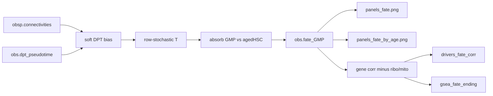

> **Demoted as hero (2026-07-30).** Type-defined GMP vs agedHSC absorption terminals make P(GMP) largely recapitulate `display_type`. Current discovery hero is the paired CHIP GEO pilot (GSE209994 + GSE298597) with a **marrow→brain** outcome axis — see `docs/solutions/architecture-patterns/chip-geo-pilot-over-display-type-fate-axis.md`. Belk et al. Nature 2026 establish aging marrow→brain myeloid influx; whether those cells are helpful or harmful is driver-dependent (TET2 vs DNMT3A). Thesis bridge: CHIP + IL-1 change myeloid metabolic state in marrow and may change engraftment / function in brain (Belk has no metabolomics). Kernel/filter polish here remains optional continuity work only.

# Harden GMP vs agedHSC fate - Plan

## Goal Capsule

**Objective:** Make the existing GMP vs agedHSC absorption-fate package scientifically honest: DPT-biased transitions, `age_bin` facets on a joint fate field, ribosomal/mito-free drivers+GSEA, and naming that matches the claim.

**Authority:** Session-settled decisions below override the 2026-07-24 age-persistence-tree hero for this workstream. Keep `explore.py` as the only analysis surface (no `plotting.py` restore). **As of 2026-07-30, this plan is no longer the project discovery hero** (see banner above).

**Stop when:** Default `python explore.py` writes renamed fate panels with age facets, uses a soft DPT-biased kernel for absorption+flow, filters ribo/mito from driver corr and prerank GSEA, `_self_check` covers those contracts, README matches.

---

## Product Contract

### Summary

Harden the shipped fate package — joint absorption once, soft PseudotimeKernel-style DPT bias, gene-only ribo/mito drop on drivers/GSEA, age_bin facets, fix leftover `panels_age_bin_fate` branding. Do not restore age-persistence trees or EM hero panels.

### Requirements

- R1. Absorption uses a soft DPT-biased transition matrix on existing neighbor connectivities (not undirected-only).
- R2. Fate probabilities are computed once on the full joint atlas (late-DPT GMP vs agedHSC terminals unchanged).
- R3. Fate figures facet or strip by `age_bin` (early/mid/late) while coloring the joint `fate_GMP` field.
- R4. Driver correlation and prerank GSEA exclude ribosomal and mitochondrial genes by gene-name rules (same filter both places).
- R5. Output filenames and README stop claiming `age_bin` in the joint-only panel name.
- R6. `_self_check` proves kernel bias, gene filter, and renamed/faceted outputs without needing GPU or the full h5ad.

### Scope Boundaries

**In scope:** `explore.py` fate kernel/plot/corr/GSEA/self_check; `README.md` output bullets.

**Out of scope:** Restoring age-persistence tree / `plotting.py`; installing CellRank; per-`age_bin` re-absorption; cell-level mito QC filters for fate; splitting `train` into a new module.

### Deferred to Follow-Up Work

- Reconcile or archive `docs/plans/2026-07-24-001-feat-age-persistence-branch-tree-plan.md` so plan docs match the fate hero.
- Optional later: per-bin absorption sensitivity check.
- **Discovery follow-up (hero lives elsewhere):** CHIP GEO pilot gate×cargo (GSE209994 BM IL-1β × Tet2; GSE298597 Tet2 vs Dnmt3a CNS). Prefer genotype × tissue (marrow→brain) over this fate axis. Immunometabolism expansion: CHIP + IL-1 myeloid metabolic programs as predictors of engraftment / function (see architecture pattern).

---

## Planning Contract

### Key Technical Decisions

- KTD1. **Hero remains GMP vs agedHSC fate harden — not age-persistence tree.** `(session-settled: user-directed — chosen over restoring 07-24 tree hero: paper claim is competing fates; tree deferred)`
- KTD2. **Joint absorption once, then facet by `age_bin`.** `(session-settled: user-directed — chosen over per-bin re-absorption: comparable fate field across ages)`
- KTD3. **Gene-name-only ribo/mito filter on drivers+GSEA.** `(session-settled: user-directed — chosen over also dropping high-`pct_counts_mt` cells: CellRank-style clean lists)`
- KTD4. **Soft DPT bias, reimplemented locally (no CellRank dep).** Match PseudotimeKernel soft scheme: down-weight edges into the pseudotemporal past; keep forward edges; row-normalize. Soft (not hard) so agedHSC (early-DPT) remains reachable as an absorbing class. Conflict call-out: hard forward-only schemes can starve reverse reachability to agedHSC — soft bias is required for this terminal pair.
- KTD5. **Reuse preprocess naming conventions for gene filters.** Mouse `mt-` / `Mt-` and `rpl`/`rps` prefixes (same spirit as `preprocess._ribo_frac` / `flag_gene_family(..., "mt-", ...)`), applied to `var_names` before corr and before building the prerank table.
- KTD6. **Rename joint panel to `panels_fate.png`; age strip to `panels_fate_by_age.png`.** Drop `panels_age_bin_fate.png` as the primary write (delete or stop writing the old name).

### Assumptions

- Soft bias parameters default near CellRank soft defaults (`b≈10`, `ν≈0.5`); tune only if self_check or smoke shows empty reverse mass to agedHSC.
- Binary fates still imply `corr_agedHSC = −corr_GMP`; the driver plot stays one-axis (corr_GMP × mean expr) — ribo/mito filter addresses content, not dimensionality.

### High-Level Technical Design

Directional soft-bias sketch (not implementation spec): for each edge weight \(C_{jk}\) with \(\Delta t = \tau_k - \tau_j\), set \(C'_{jk} = C_{jk}\,f(\Delta t)\) where \(f(\Delta t)=1\) if \(\Delta t \ge 0\), else the CellRank soft logistic down-weight; then row-normalize to \(T\). Use the same \(T\) for absorption and UMAP flow quiver.

---

## Implementation Units

### U1. Soft DPT-biased transition matrix

**Goal:** Replace undirected-only `_row_stochastic(connectivities)` in absorption (and fate flow) with a soft DPT-biased \(T\).

**Requirements:** R1, R2

**Dependencies:** none

**Files:** `explore.py` (modify)

**Approach:** Add a small helper that takes connectivities + `dpt_pseudotime`, applies soft past-edge down-weighting, row-normalizes. `compute_fate_probs` and `plot_fate_umap` flow both consume that \(T\). Keep terminal selection unchanged (late-DPT GMP vs all agedHSC). Record bias scheme + params in `uns["fate_terminals"]`.

**Patterns to follow:** Current `_row_stochastic` / `compute_fate_probs` loop; CellRank PseudotimeKernel soft scheme (docs + CellRank 2 paper) without importing cellrank.

**Test scenarios:**
- Synthetic graph with clear DPT gradient: forward neighbor weight after bias ≥ reverse neighbor weight for the same undirected edge.
- After absorb with two terminals, `fate_GMP + fate_agedHSC ≈ 1` on non-isolated cells.
- Empty/missing `dpt_pseudotime` still raises the existing KeyError.

**Verification:** `_self_check` asserts forward≥reverse on a constructed edge pair; absorption still completes.

---

### U2. Shared ribo/mito gene filter on drivers and GSEA

**Goal:** One filter function drops ribosomal/mito genes from corr input and prerank ranking.

**Requirements:** R4

**Dependencies:** none (can parallel U1)

**Files:** `explore.py` (modify)

**Approach:** `is_ribo_or_mito(name)` using casefold prefixes aligned with preprocess (`rpl`, `rps`, `mt-`). `gene_fate_correlations` subsets columns before corr; `run_ending_gsea` consumes the already-filtered table (do not reintroduce filtered genes). CSV may note `n_genes_kept`.

**Patterns to follow:** `preprocess._ribo_frac` / `flag_gene_family(..., "mt-", ...)`.

**Test scenarios:**
- Synthetic var_names include `Rpl13a`, `mt-Nd1`, `Elane`: filter keeps `Elane`, drops the other two.
- Corr/GSEA path never ranks a gene matching the filter.

**Verification:** `_self_check` builds adata with decoy ribo/mito genes and asserts they are absent from returned corr table.

---

### U3. Age_bin facets + rename outputs + README

**Goal:** Joint fate panel renamed; age strip written; README bullets match.

**Requirements:** R3, R5

**Dependencies:** U1 (flow uses biased \(T\); optional to land after)

**Files:** `explore.py` (modify), `README.md` (modify)

**Approach:** `plot_fate_umap` writes `panels_fate.png` (joint 1×2). New or extended plot writes `panels_fate_by_age.png` as a row-per-`age_bin` strip coloring joint `fate_GMP` (and types or fate-only — prefer fate | types per age to mirror prior EM strip density without new claims). Stop writing `panels_age_bin_fate.png`. Update README artifact list.

**Patterns to follow:** Former EM-by-age strip layout (removed) — one row per age; current joint fate 1×2.

**Test scenarios:**
- Synthetic `age_bin` early/mid/late → age strip path exists and joint path is `panels_fate.png`.
- Old filename not written by the package path.

**Verification:** `_self_check` asserts new paths exist; README lists the new names.

---

### U4. Wire `run_fate_package` + expand `_self_check`

**Goal:** Default CLI path exercises U1–U3; self_check is the regression net.

**Requirements:** R6

**Dependencies:** U1, U2, U3

**Files:** `explore.py` (modify)

**Approach:** `run_fate_package` calls biased absorb → joint plot → age strip → filtered corr → GSEA. Expand `_self_check` to cover U1–U3 assertions in one function (still no gseapy network call required).

**Execution note:** Prefer smoke on synthetic `_self_check` first; full h5ad run is optional verification after.

**Test scenarios:**
- `explore._self_check()` exits 0 and prints OK.
- Package function list of written paths includes `panels_fate.png` and `panels_fate_by_age.png` on synthetic out_dir.

**Verification:** Docstring/README usage lines still accurate (`python explore.py`, `--train`, `_self_check`).

---

## Verification Contract

- Gate 1: `source .venv/bin/activate && python -c "import explore; explore._self_check()"`
- Gate 2 (optional smoke): `python explore.py` against existing labeled h5ad; confirm new PNGs/CSV under `results/joint_hsc_aging/` and absence of new writes to `panels_age_bin_fate.png`
- No pytest suite — repo convention is `_self_check` only

## Definition of Done

- [ ] Soft DPT-biased \(T\) used for absorption and flow
- [ ] Joint fate computed once; age facets display that field
- [ ] Ribo/mito genes absent from driver corr + GSEA prerank
- [ ] `panels_fate.png` + `panels_fate_by_age.png` written; README updated
- [ ] `_self_check` covers kernel bias, gene filter, and filenames
- [ ] Age-persistence tree / CellRank install not reintroduced

## Product Contract preservation

Product Contract created in this bootstrap from session-settled harden scope (no upstream requirements-only unified plan).
